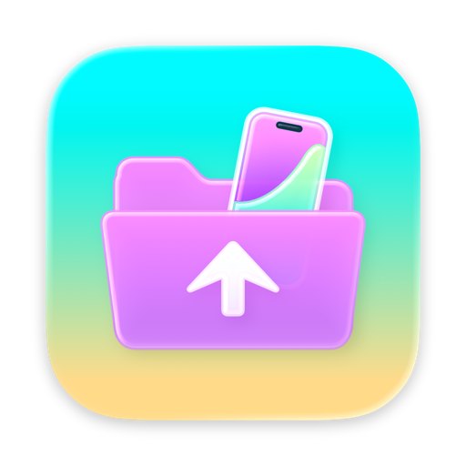
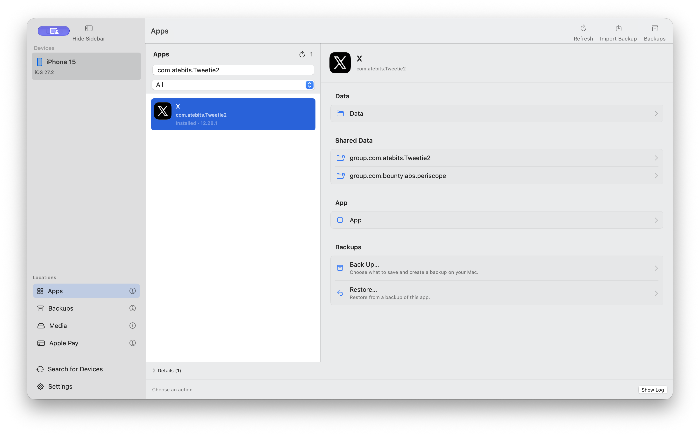
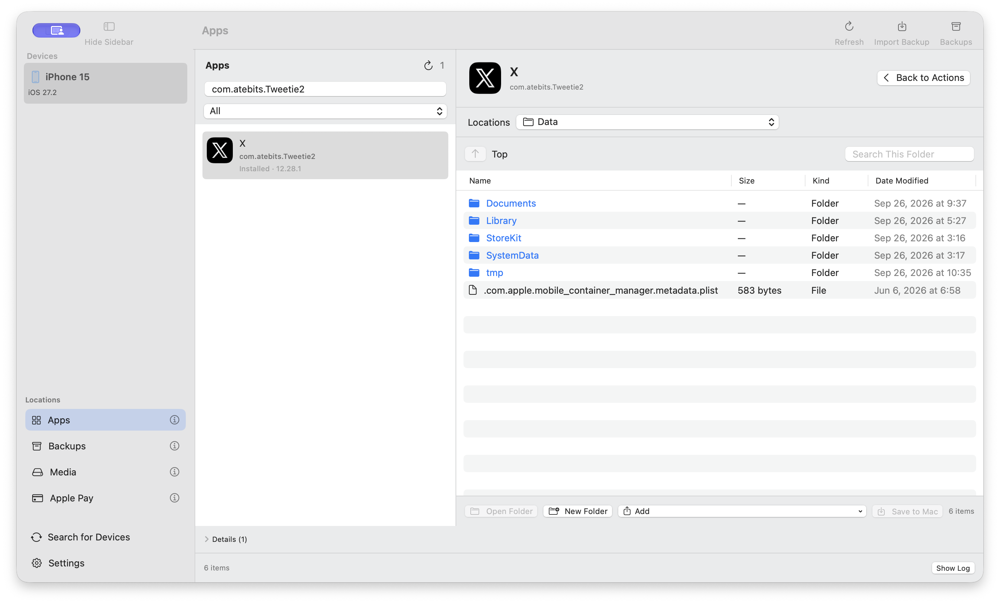
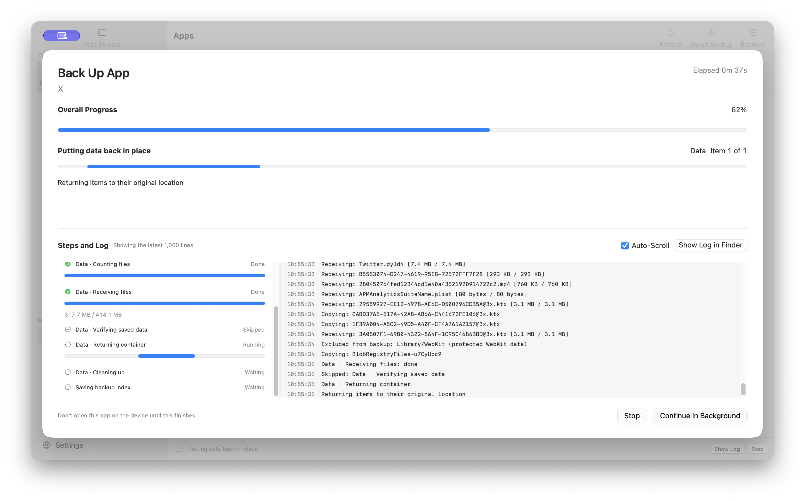
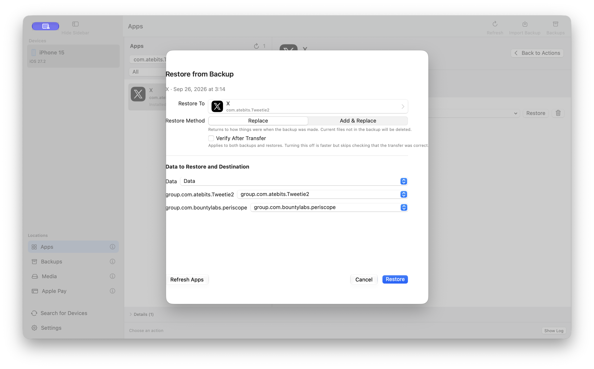
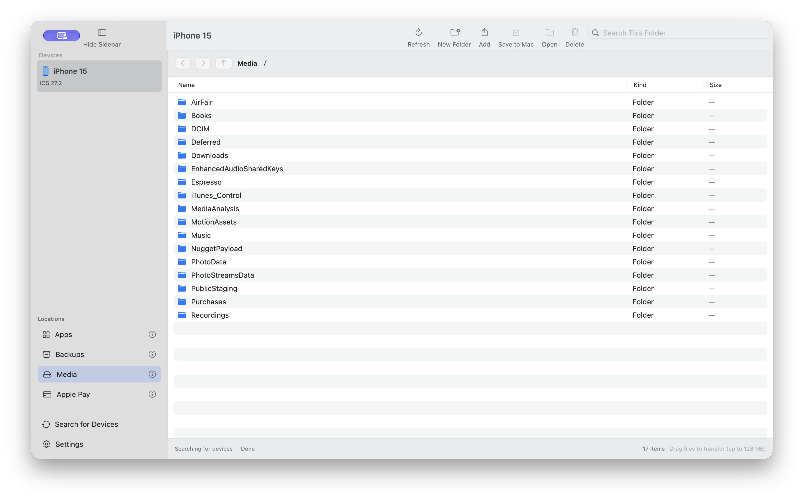
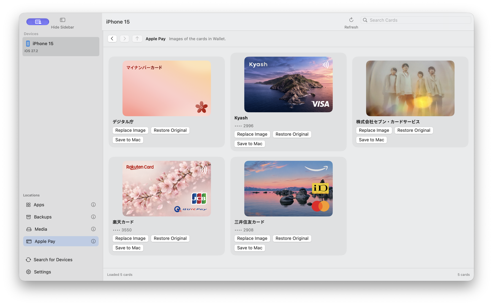

<h1 align="center">
  <br>
  Airlift Browser
</h1>

[日本語](README.md) | English | [简体中文](README.zh-Hans.md)

Airlift Browser is a macOS app for exploring an iPhone or iPad over USB, saving an individual app's data to your Mac, and restoring it later.

A Finder backup saves the entire device; it does not let you extract or restore just one app. Airlift Browser handles apps individually. On a physical device, a 2.5 GB app backup covering all its regions was restored and verified against the original data.

Requires macOS 14 or later. Choose Japanese, English, or Simplified Chinese in Settings; restart the app to apply the change.



## Getting started

### 1. Install Python and pymobiledevice3

```sh
brew install python
$(brew --prefix)/bin/python3 -m pip install pymobiledevice3
```

> [!IMPORTANT]
> Install `pymobiledevice3` into Homebrew's Python. The app only looks for `/opt/homebrew/bin/python3` and `/usr/local/bin/python3`; it will not find packages installed into pyenv, conda, or a virtual environment.

Building also requires the full Xcode app; Command Line Tools alone are not enough.

### 2. Build and launch

```sh
git submodule update --init --recursive
make        # Build dist/Airlift Browser.app
make open   # Build and launch
```

This build is intended to run on your own Mac. It does not include distribution signing or Apple notarization.

> [!TIP]
> If macOS blocks the app, right-click `dist/Airlift Browser.app` in Finder and choose Open.

To edit the source, open `Package.swift` in Xcode.

### 3. Connect and trust your device

Connect your device with a cable, unlock it, and tap **Trust This Computer** on the device. It is ready when it appears under Devices in the sidebar. If it does not appear, click **Search for Devices** at the bottom of the sidebar.

> [!IMPORTANT]
> Enable Developer Mode in the device's Settings. Without it, the app cannot find residual data from removed apps or automatically stop the target app before a backup or restore.

> [!WARNING]
> Do not open the target app on your device during a backup or restore. Running it can interrupt the transfer.

## Using the app

The Locations sidebar has four views: Apps, Backups, Media, and Apple Pay. Hover over ⓘ for a description. **Refresh** (`⌘R`) reloads the current view.

### Browse an app's files like in Finder

**Apps** lists the apps on your device. Search by name, then use the kind menu to choose **All**, **Installed**, **Apple**, or **Leftover Data** (data left behind by removed apps).

Select an app to open its actions. You can browse three regions:

- **Data** — files belonging to that app, including documents, settings, and caches.
- **Shared Data** — data shared with extensions or other apps.
- **App** — the app bundle itself. You can view and export it, but not restore it to the device.



Double-click a folder to open it. **Search This Folder** filters the current folder.

To export files to your Mac, drag them into Finder or right-click and choose **Save to Mac…**. You can select multiple files to save or delete together. To send files to the device, drag them from Finder into the window or use the **Add** menu. Rename and Replace are in the context menu.

The app bundle is read-only: you cannot add, rename, delete, or replace its files.

> [!TIP]
> Opened listings stay on screen, so moving between folders does not contact the device again. They reflect the state when opened. **If the device's files change, click Refresh.**

### Choose what to include in a backup

Click **Backup** in the toolbar or app actions to choose which regions to save. All three are selected by default. Each backup copies everything again; a 2.5 GB app takes about two minutes.

Selecting fewer regions is faster. For example, backing up only Data uses less space and time, but Shared Data and the app bundle will not be saved.

**Verify After Transfer** applies to both backup and restore. It is on by default; turning it off is faster but skips checking whether the transfer was correct.

Backups are stored at this fixed location. Open it in Finder from **Storage Locations** in Settings.

```
~/Library/Application Support/Airlift Browser/Backups/
```

When a job starts, a progress-and-log window opens. It shows each step as pending, running, complete, skipped, or interrupted, along with overall progress, bytes transferred, speed, and the current filename. Use it to tell whether a job is still moving.



For long jobs, **Continue in Background** closes this window so you can return to other work. After clicking **Stop**, the window stays open until the device's data has been returned to its original location. Check the log before closing it. Full logs are saved under `~/Library/Application Support/Airlift Browser/Logs/`; the window displays the latest 1,000 lines.

If a cable disconnects or a job otherwise stops partway through, reconnecting shows the number of unfinished tasks. Click **Recover Unfinished Tasks** to return the device to its original state.

### Choose where and how to restore

In **Backups**, select a backup and click **Restore**. Make three choices:



**Target app.** Choose the app again if needed, including a reinstalled copy or the same app on another device. If the list is stale, click **Refresh App List**.

**Restore method.** Choose one of these:

- **Replace** — return to the backed-up state; files currently present but absent from the backup are deleted.
- **Add & Replace** — overwrite files with the same names and leave other files in place.

**Source and destination regions.** For each saved region, choose its destination or **Do Not Restore**. Map multiple Shared Data regions one by one.

If a backup's contents have changed since it was saved, you will see a mismatch warning before restoring.

> [!WARNING]
> A backup marked **Partly saved** cannot be restored with Replace: missing files would otherwise make the result look like a complete restore. A backup marked **Incomplete** stopped partway through and cannot be restored at all.

### Organize saved backups

**Backups** lists backups on your Mac. Right-click one to rename it, show it in Finder, export it, restore it, or move it to Trash. macOS Trash lets you recover a deleted backup later.

You can browse and edit a backup's contents in the same file view used for a device. Edits are saved as a new backup; the original stays intact.

There are two export formats. **Airlift Browser** can be imported back into this app and preserves all saved regions. **Xcode** (`.xcappdata`) can be read by Xcode but contains Data only. Use Airlift Browser format to keep Shared Data and the app bundle.

Use **Import Backup** in the toolbar to import either format.

### Media transfers are limited to 128 MB per operation; deletion is permanent

**Media** contains device areas such as photos, music, and downloads. You can browse, transfer files to and from your Mac, rename, and delete. Finder drag-and-drop and multiple selection are supported.



A single transfer is limited to 128 MB. App backups use a different mechanism, so this limit does not apply to multi-gigabyte backups.

> [!CAUTION]
> Deleting from Media is permanent. Files do not go to Trash.

### Replace only the artwork of an Apple Pay card

**Apple Pay** shows images of cards in Wallet. For each card you can **Replace Image**, **Restore Original**, or **Save to Mac**. This changes only the displayed artwork, not card details or numbers.



## What it can and cannot do

Airlift Browser focuses on moving one app's data at a time.

It can:

- List installed apps and residual data from removed apps.
- Back up an individual app and restore selected regions.
- Browse, export, add, replace, or delete individual app files.
- Browse and transfer Media files, and replace Apple Pay card artwork.

It cannot:

- Back up an entire device in one operation.
- Make incremental backups; every backup is a full copy.
- Back up only selected files inside an app.
- Create password-protected or encrypted backups.
- Process multiple apps in one batch.
- Read or write Finder's device-backup format.
- Restore an app bundle.

Some files, such as browser caches, may be blocked from reading by the device. Such backups are marked **Partly saved** and cannot be restored with Replace.

## For developers

Build internals, tests, and physical-device validation notes are in [DEVELOPMENT.md](DEVELOPMENT.md) (Japanese).

## License

This repository is released under the [MIT License](LICENSE).

## Credits

- [airlift](https://github.com/0xjohnnydev/airlift) — Johnny Franks ([@0xjohnnydev](https://github.com/0xjohnnydev)), MIT.
- [Airlift Cards](https://github.com/licht-jb/AirliftCards) — MIT; reading and replacing Apple Pay card artwork.
