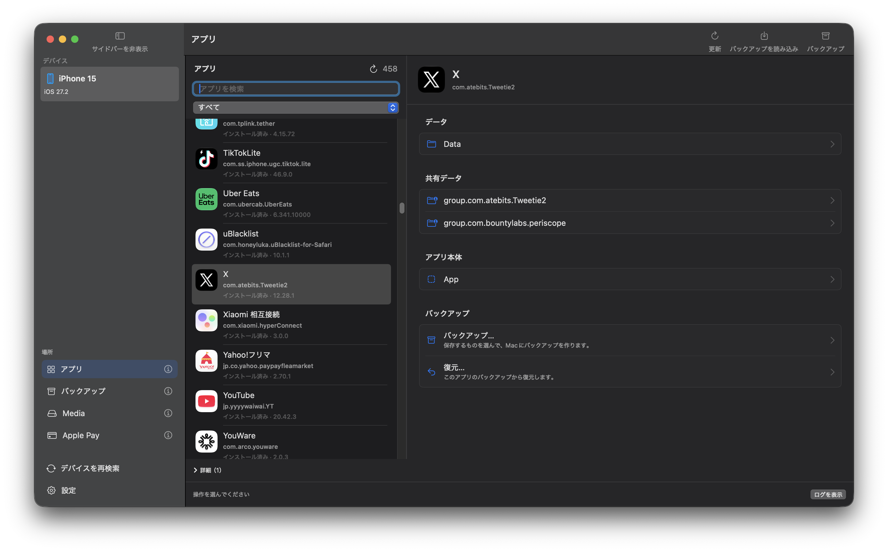
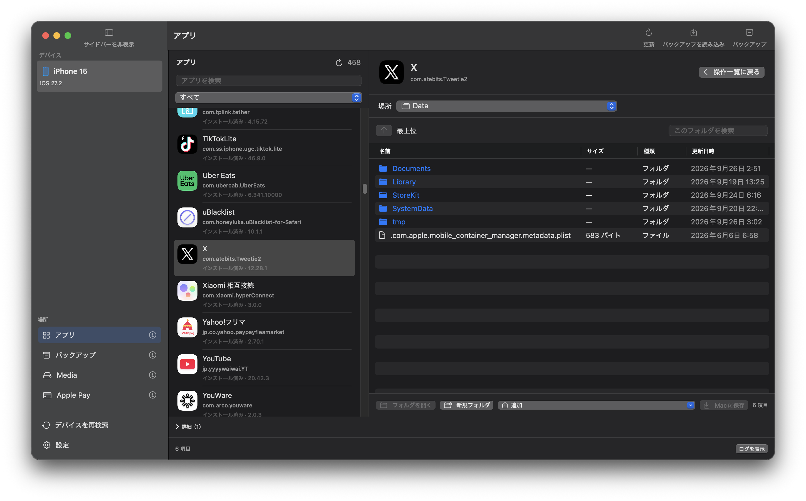
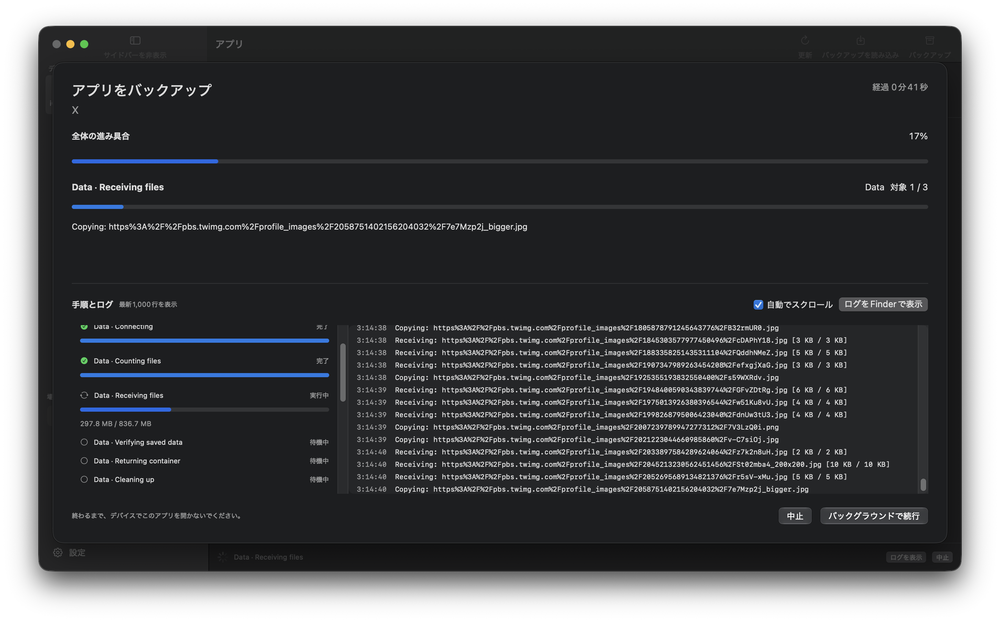
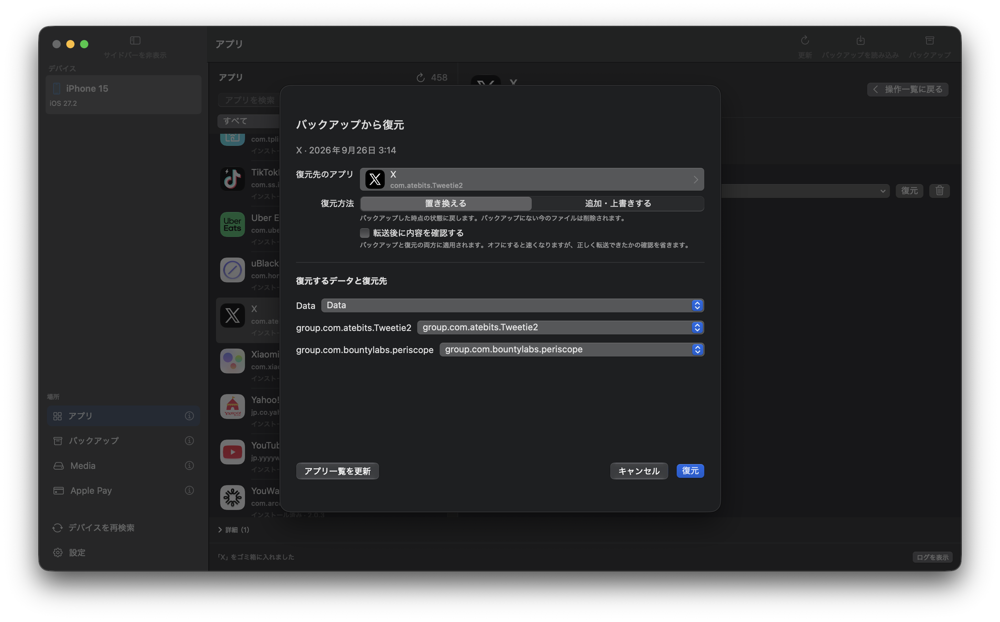
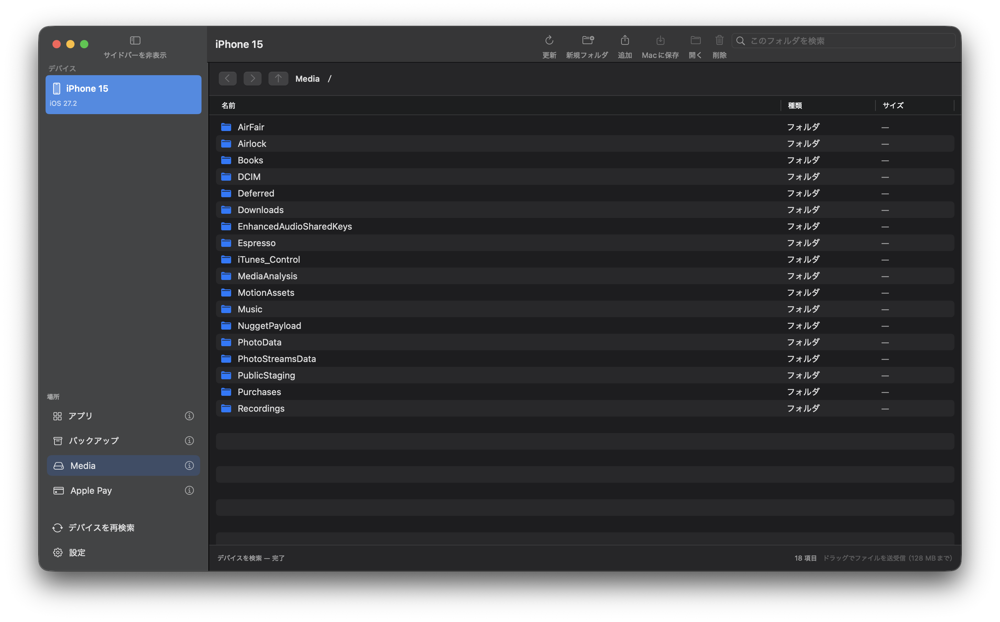
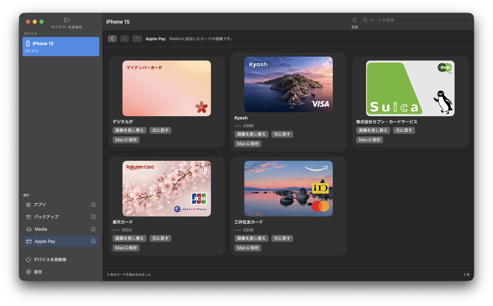

# Airlift Browser

iPhone / iPad を USB でつなぎ、端末の中身を Mac の画面で見たり、アプリのデータを丸ごと Mac に保存したりできる macOS アプリです。保存したデータは、あとから端末に戻せます。

Apple 標準のバックアップ（Finder 経由）は端末全体をまとめて保存するので、アプリを 1 つだけ選んで取り出したり戻したりはできません。このアプリは、その 1 アプリ単位の出し入れを受け持ちます。実機では 2.5 GB のアプリ 1 件の全領域を保存し、復元した内容が保存前と一致することまで確かめています。

macOS 14 以降で動作します。画面の言語は設定画面で日本語・英語・簡体字中国語から選べます（再起動後に反映）。



## はじめ方

### 1. Python と pymobiledevice3 を用意する

```sh
brew install python
$(brew --prefix)/bin/python3 -m pip install pymobiledevice3
```

> [!IMPORTANT]
> `pymobiledevice3` は Homebrew の Python に入れてください。このアプリが探すのは `/opt/homebrew/bin/python3` と `/usr/local/bin/python3` の 2 つだけで、pyenv・conda・venv に入れた Python は見つけられません。

ビルドには Xcode 本体も必要です（Command Line Tools だけでは足りません）。

### 2. ビルドして起動する

```sh
git submodule update --init --recursive
make        # dist/Airlift Browser.app を作る
make open   # ビルドして起動
```

できあがるのは自分の Mac で動かすためのアプリで、配布向けの署名と Apple の公証は含みません。

> [!TIP]
> 起動を拒まれたときは、Finder で `dist/Airlift Browser.app` を右クリックして「開く」を選びます。

ソースを編集するときは、Xcode で `Package.swift` を開きます。

### 3. 端末をつないで信頼する

ケーブルで端末をつなぎ、ロックを解除して、端末に出る「このコンピュータを信頼」を選びます。サイドバーの「デバイス」に端末が並べば準備完了です。並ばないときはサイドバー下の「デバイスを再検索」を押してください。

> [!IMPORTANT]
> 端末の「設定」で開発者モードを有効にしておいてください。無効のままだと、削除済みアプリの残りデータを見つけられず、バックアップや復元の前に対象アプリを自動で終了させることもできません。

> [!WARNING]
> バックアップと復元のあいだは、端末で対象アプリを開かないでください。アプリが動いていると、転送が途中で止まります。

## 使い方

サイドバーの「場所」から、アプリ・バックアップ・Media・Apple Pay の 4 つの画面を選びます。各項目の ⓘ にマウスを重ねると説明が出ます。どの画面でも「更新」（`⌘R`）で最新の状態を読み直せます。

### アプリの中身は Finder と同じ感覚で見られる

「アプリ」を選ぶと、端末のアプリが一覧で並びます。検索欄に名前を入れると絞り込めます。その下の種類メニューでは「すべて」「インストール済み」「Apple製」「残りデータ」（削除済みアプリが端末に残したデータ）を切り替えられます。

アプリを選ぶと操作一覧が開き、次の 3 つの場所に入れます。

- **データ** … そのアプリだけのファイル。書類や設定、キャッシュが入っています
- **共有データ** … 拡張機能など、ほかのアプリと共有しているデータ
- **アプリ本体** … プログラムそのもの。見て取り出すための場所で、端末には戻せません



フォルダはダブルクリックで開きます。右上の「このフォルダを検索」で、いま開いているフォルダの中を絞り込めます。

ファイルを Mac に取り出す方法は 2 つあります。Finder へドラッグするか、右クリックして「Macに保存…」を選ぶかです。複数選んでまとめて保存・削除もできます。反対に、Finder から画面へドラッグするか、下の「追加」メニューを使えば、Mac のファイルを端末に送れます。名前の変更と置き換えは右クリックメニューにあります。

アプリ本体は読み取り専用です。追加・名前の変更・削除・置き換えはできません。

> [!TIP]
> 一度開いた場所の一覧は画面に残るので、フォルダを行き来しても端末との通信は発生しません。そのぶん表示は開いた時点のままです。**端末側で中身が変わったときは「更新」を押してください。**

### バックアップは保存する場所を選んで取る

ツールバーか操作一覧の「バックアップ」を押すと、保存する場所を選べます。最初は 3 つともチェックが入っています。毎回すべてを取り直す方式で、2.5 GB のアプリなら 2 分ほどかかります。

チェックを減らすと速くなります。たとえば「データ」だけなら容量も時間も少なく済みますが、共有データとアプリ本体は保存されません。

同じ画面の「転送後に内容を確認する」は、バックアップと復元で共通の設定です。初期状態はオンで、オフにすると速くなる代わりに、正しく転送できたかの確認を省きます。

保存先は次の場所に固定されています。設定画面の「保存場所」から Finder で開けます。

```
~/Library/Application Support/Airlift Browser/Backups/
```

処理が始まると、進み具合とログの画面が開きます。工程ごとに「待機中・実行中・完了・スキップ・中断」の状態が並び、全体の進み具合、転送量と速さ、処理中のファイル名も表示されます。止まっているのか進んでいるのかは、ここで判断できます。



時間がかかるときは「バックグラウンドで続行」で画面を閉じて、ほかの操作に戻れます。「中止」を押しても、端末のデータを元の場所に戻し終えるまでは画面が閉じません。終わったらログを確かめてから閉じてください。全ログは `~/Library/Application Support/Airlift Browser/Logs/` に保存され、画面には最新 1,000 行を表示します。

ケーブルが抜けるなどして処理が途中で切れた場合は、再接続すると「中断した処理が N 件あります」と表示されます。「中断した処理を復旧」を押すと、端末を元の状態に戻します。

### 戻すときは「どのアプリへ」「どう戻すか」を決める

「バックアップ」画面で戻したいバックアップを選び、「復元」を押します。決めることは 3 つです。



**どのアプリに戻すか。** 復元先のアプリを選び直せるので、再インストールしたアプリや、別の端末に入っている同じアプリも指定できます。一覧が古いときは「アプリ一覧を更新」を押します。

**どう戻すか。** 次の 2 つから選びます。

- **置き換える** … バックアップを取った時点の状態に戻します。いまあってバックアップにないファイルは削除されます
- **追加・上書きする** … 同じ名前のファイルだけを上書きし、それ以外はそのまま残します

**何をどこへ戻すか。** バックアップに入っている場所ごとに、復元先のどの場所へ入れるか、あるいは「復元しない」かを決めます。共有データは複数あることがあるので、1 つずつ指定します。

保存後にバックアップの中身が変わっていた場合は、復元の前に「記録と違います」と確認されます。

> [!WARNING]
> 「一部を保存できず」と表示されたバックアップは、「置き換える」では復元できません。保存できなかったファイルがあるのに、丸ごと戻したことになってしまうからです。「未完了」と表示されたバックアップは途中で止まったものなので、復元自体ができません。

### 保存したバックアップは右クリックで整理する

「バックアップ」画面には、Mac に保存したバックアップが並びます。右クリックすると、名前の変更、Finder での表示、書き出し、復元、ゴミ箱への移動ができます。削除したものは macOS のゴミ箱に入るので、あとから戻せます。

バックアップの中身も端末と同じ画面で見られ、編集もできます。編集結果は別のバックアップとして保存され、元のバックアップはそのまま残ります。

書き出しの形式は 2 つです。`Airlift Browser` 形式は、このアプリでそのまま読み込み直せます。`Xcode 形式`（`.xcappdata`）は Xcode で読めますが、含まれるのはデータだけです。共有データやアプリ本体まで残したいときは `Airlift Browser` 形式を使ってください。

書き出したものは、ツールバーの「バックアップを読み込み」でどちらの形式も読み込めます。

### Media の送受信は 1 回 128 MB まで、削除は元に戻せない

「Media」は、端末の写真や音楽、ダウンロードなどが入っている領域です。閲覧、Mac との送受信、名前の変更、削除ができ、Finder からのドラッグ＆ドロップと複数選択にも対応しています。



1 回に送受信できるのは 128 MB までです。アプリのバックアップとは別の仕組みなので、10 GB 規模のバックアップにはこの上限はかかりません。

> [!CAUTION]
> Media での削除は元に戻せません。ゴミ箱にも入りません。

### Apple Pay ではカードの図柄だけを差し替えられる

「Apple Pay」では、Wallet に入れたカードの画像が並びます。カードごとに「画像を差し替え」「元に戻す」「Macに保存」ができます。変わるのは表示される図柄だけで、カードの情報や番号には触れません。



## できること、できないこと

このアプリは、1 つのアプリのデータを出し入れすることに絞っています。

できること:

- インストール済みアプリと、削除済みアプリの残りデータの一覧
- 1 アプリ単位のバックアップと、場所を指定した復元
- アプリの中のファイルを 1 つずつ閲覧・取り出し・追加・置き換え・削除
- Media の閲覧と送受信、Apple Pay のカード画像の差し替え

できないこと:

- 端末全体のバックアップ（1 アプリずつ保存します）
- 差分バックアップ（2 回目も丸ごと取り直します）
- アプリの中の一部のファイルだけのバックアップ
- パスワード付き・暗号化されたバックアップ
- 複数アプリの一括処理
- Finder のバックアップ形式の読み書き
- アプリ本体の復元

ブラウザのキャッシュのように、端末が読み出しを禁じているファイルは保存できないことがあります。その場合バックアップには「一部を保存できず」と表示され、「置き換える」での復元はできません。

## 開発者向け

ビルドの内部、テスト手順、実機検証の記録は [DEVELOPMENT.md](DEVELOPMENT.md) にまとめています。

## クレジット

- [airlift](https://github.com/0xjohnnydev/airlift) — Johnny Franks（[@0xjohnnydev](https://github.com/0xjohnnydev)）、MIT
- [Airlift Cards](https://github.com/licht-jb/AirliftCards) — MIT。Apple Pay の券面の読み出しと差し替え
