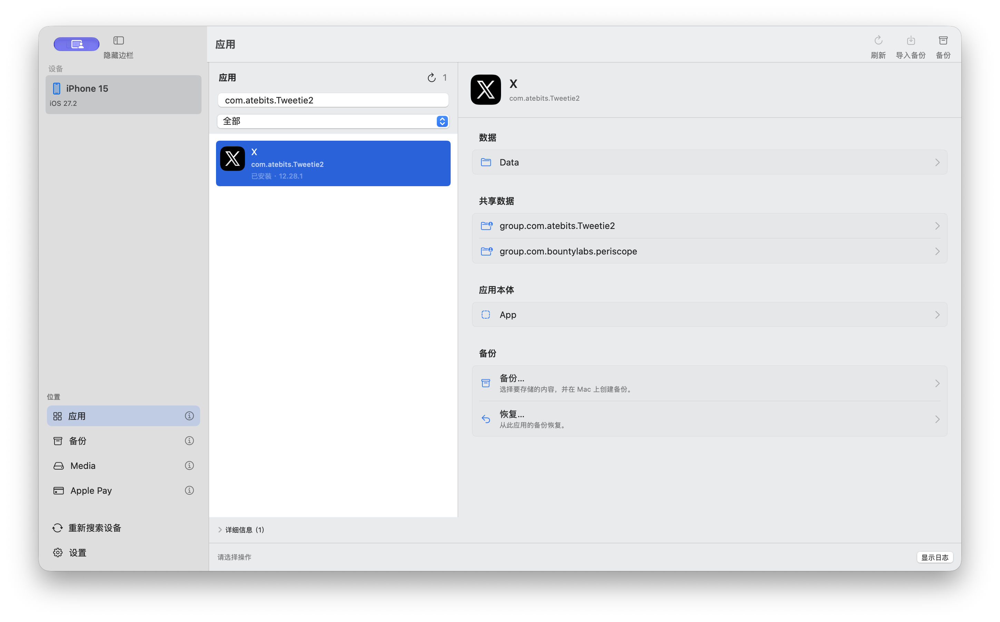
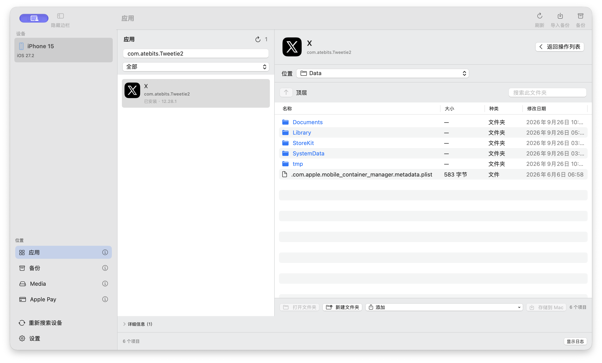
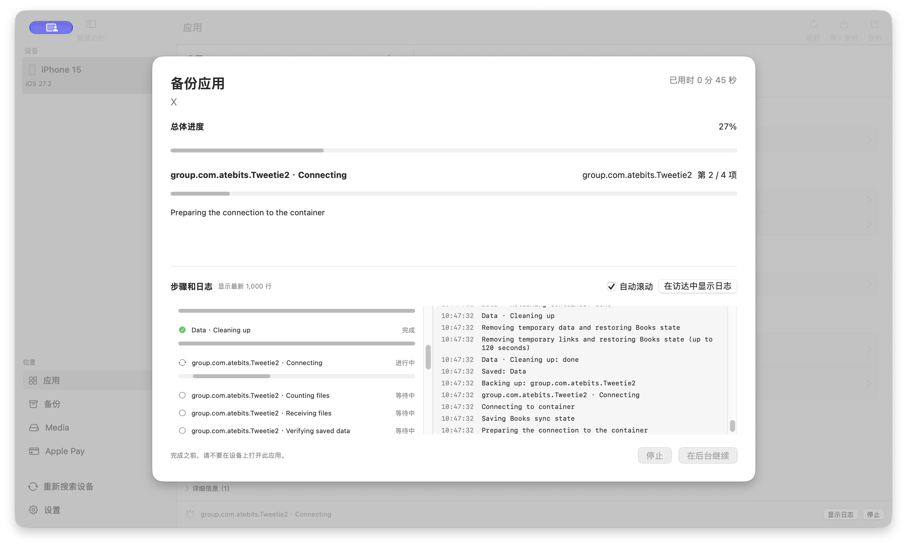
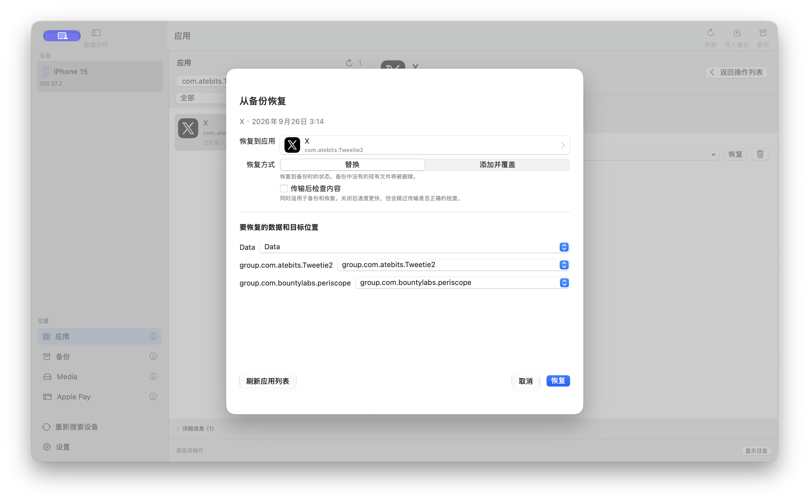
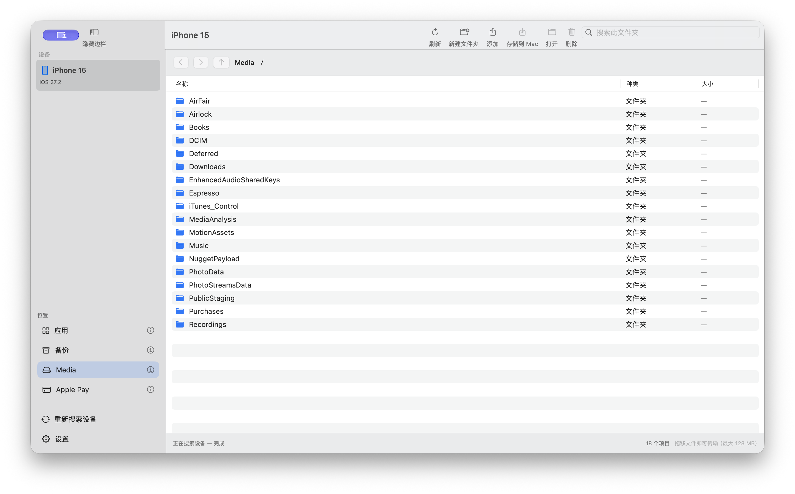
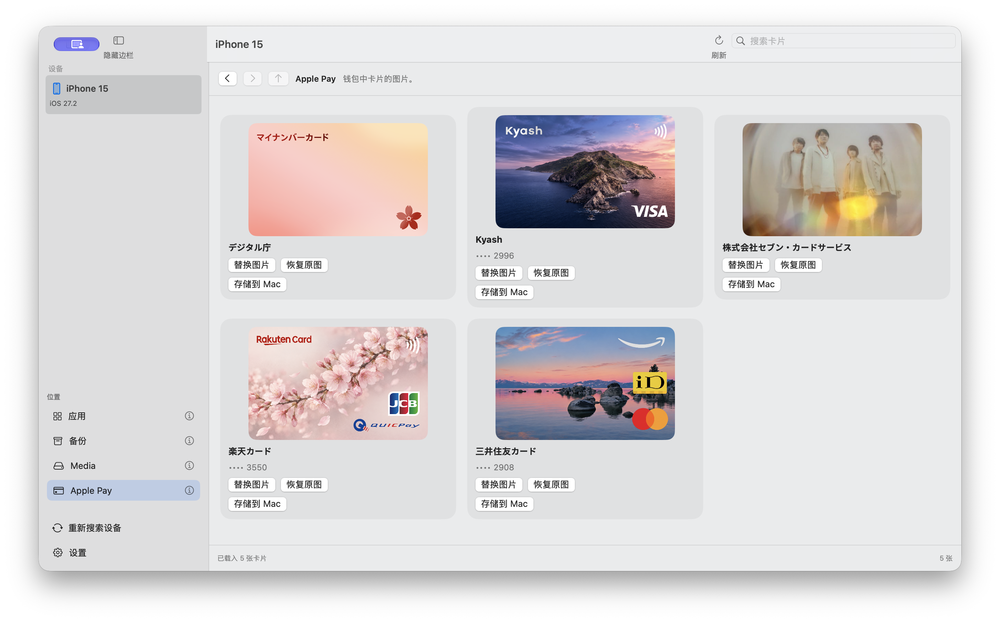

<h1 align="center">
  <br>
  Airlift Browser
</h1>

[日本語](README.md) | [English](README.en.md) | 简体中文

Airlift Browser 是一款 macOS 应用。通过 USB 连接 iPhone 或 iPad 后，可以在 Mac 上浏览设备内容、单独保存某个应用的数据，并在以后将数据恢复到设备。

Finder 的标准备份会保存整台设备，无法只提取或恢复一个应用。Airlift Browser 按应用分别处理。在真机上，已验证完整保存一个约 2.5 GB 应用的全部区域，并在恢复后确认内容与备份前一致。

需要 macOS 14 或更高版本。可在设置中选择日语、英语或简体中文；重新启动应用后生效。



## 开始使用

### 1. 安装 Python 和 pymobiledevice3

```sh
brew install python
$(brew --prefix)/bin/python3 -m pip install pymobiledevice3
```

> [!IMPORTANT]
> 请将 `pymobiledevice3` 安装到 Homebrew 的 Python 中。应用只查找 `/opt/homebrew/bin/python3` 和 `/usr/local/bin/python3`，不会找到安装在 pyenv、conda 或虚拟环境中的软件包。

构建还需要完整的 Xcode 应用；仅安装 Command Line Tools 不够。

### 2. 构建并启动

```sh
git submodule update --init --recursive
make        # 生成 dist/Airlift Browser.app
make open   # 构建并启动
```

此构建供你在自己的 Mac 上使用，不包含分发用签名或 Apple 公证。

> [!TIP]
> 如果 macOS 阻止启动，请在 Finder 中右键点击 `dist/Airlift Browser.app`，然后选择“打开”。

若要编辑源码，请在 Xcode 中打开 `Package.swift`。

### 3. 连接并信任设备

用数据线连接设备，解锁设备，并在设备上选择“信任此电脑”。设备出现在侧边栏的“设备”下，即表示准备就绪。如果未出现，请点击侧边栏底部的“搜索设备”。

> [!IMPORTANT]
> 请在设备的“设置”中启用开发者模式。否则，应用无法发现已删除应用留下的数据，也无法在备份或恢复前自动停止目标应用。

> [!WARNING]
> 备份和恢复期间，不要在设备上打开目标应用。应用运行时，传输可能中断。

## 使用方法

侧边栏的“位置”中有四个视图：应用、备份、Media 和 Apple Pay。将鼠标悬停在 ⓘ 上可查看说明。在任何视图中点击“刷新”（`⌘R`）即可重新读取当前状态。

### 像使用 Finder 一样浏览应用文件

“应用”会列出设备上的应用。可按名称搜索，再使用类型菜单选择“全部”“已安装”“Apple 应用”或“残留数据”（已删除应用留在设备上的数据）。

选中应用后会打开操作列表，可以浏览三个区域：

- **数据**：该应用自己的文件，包括文稿、设置和缓存。
- **共享数据**：与扩展程序或其他应用共享的数据。
- **应用本体**：应用程序本身。可查看和导出，但不能恢复到设备。



双击文件夹即可打开。“搜索此文件夹”可筛选当前文件夹的内容。

要将文件导出到 Mac，可拖入 Finder，或右键点击并选择“保存到 Mac…”。也可以多选文件，一次保存或删除。要向设备发送文件，可从 Finder 拖入窗口，或使用“添加”菜单。重命名和替换位于右键菜单中。

应用本体是只读的：不能向其中添加文件，也不能重命名、删除或替换文件。

> [!TIP]
> 打开过的文件列表会保留在界面上，因此在文件夹之间切换不会再次与设备通信。列表显示的是打开时的状态。**如果设备上的内容发生变化，请点击“刷新”。**

### 选择备份内容

点击工具栏或操作列表中的“备份”，选择要保存的区域。默认选中全部三个区域。每次都会重新完整备份；约 2.5 GB 的应用需要两分钟左右。

减少选中区域可以缩短时间。例如只备份“数据”会节省空间和时间，但不会保存共享数据和应用本体。

“传输后检查内容”同时适用于备份和恢复。默认开启；关闭后速度更快，但会跳过传输结果校验。

备份固定保存在以下位置。可通过设置中的“存储位置”在 Finder 中打开。

```
~/Library/Application Support/Airlift Browser/Backups/
```

任务开始后会打开进度和日志窗口。每个步骤会显示等待、运行、完成、跳过或中断状态，同时显示总体进度、传输量、速度和当前文件名。可在这里判断任务是否仍在继续。



耗时较长时，可点击“在后台继续”关闭窗口并返回其他操作。点击“停止”后，窗口会一直显示，直到设备数据回到原来的位置。关闭前请检查日志。完整日志保存在 `~/Library/Application Support/Airlift Browser/Logs/`；窗口显示最近 1,000 行。

如果拔掉数据线等原因导致任务中断，重新连接后会显示未完成操作的数量。点击“恢复未完成的操作”，可将设备恢复到原来的状态。

### 选择恢复到哪个应用以及如何恢复

在“备份”中选中备份并点击“恢复”。需要决定三件事：



**目标应用。** 可以重新选择恢复目标，包括重新安装的应用，或另一台设备上的同一应用。如果列表过期，请点击“刷新应用列表”。

**恢复方式。** 二选一：

- **替换**：恢复到备份时的状态；当前存在而备份中没有的文件会被删除。
- **添加并覆盖**：只覆盖同名文件，其他文件保持不变。

**备份区域及目标区域。** 为备份中的每个区域选择恢复目标，或选择“不恢复”。如果有多个共享数据区域，需要逐一指定。

如果备份内容在保存后发生变化，恢复前会显示内容不匹配的警告。

> [!WARNING]
> 标记为“部分未存储”的备份不能使用“替换”方式恢复，否则缺失的文件会让结果看起来像完整恢复。标记为“未完成”的备份已在途中停止，不能恢复。

### 整理已保存的备份

“备份”视图列出 Mac 上的备份。右键点击可重命名、在 Finder 中显示、导出、恢复或移到废纸篓。移到 macOS 废纸篓的备份以后仍可找回。

备份内容也可以在与设备文件相同的界面中浏览和编辑。编辑结果会保存为新备份，原备份保持不变。

有两种导出格式。**Airlift Browser** 格式可直接重新导入本应用，并保留所有已保存区域。**Xcode** 格式（`.xcappdata`）可由 Xcode 读取，但只包含数据。若要保留共享数据和应用本体，请使用 Airlift Browser 格式。

点击工具栏中的“导入备份”，可导入任一格式。

### Media 单次传输上限为 128 MB；删除后不可恢复

“Media”包含设备上的照片、音乐和下载内容等区域。可浏览、与 Mac 互传、重命名和删除文件，并支持 Finder 拖放和多选。



单次传输上限为 128 MB。应用备份使用另一套机制，因此数 GB 的备份不受此限制。

> [!CAUTION]
> 在 Media 中删除文件是永久操作，不会移入废纸篓。

### 只替换 Apple Pay 卡片的图案

“Apple Pay”显示 Wallet 中卡片的图片。每张卡都可以“替换图片”“恢复原图”或“保存到 Mac”。更改仅限显示的图案，不会触及卡片信息或卡号。



## 能做什么，不能做什么

Airlift Browser 专注于一次处理一个应用的数据。

可以：

- 列出已安装应用以及已删除应用留下的数据。
- 单独备份一个应用，并按区域恢复。
- 逐个浏览、导出、添加、替换或删除应用文件。
- 浏览并传输 Media 文件，替换 Apple Pay 卡片图案。

暂不支持：

- 一次备份整台设备。
- 增量备份；每次都会完整复制。
- 只备份应用中的部分文件。
- 创建密码保护或加密备份。
- 批量处理多个应用。
- 读取或写入 Finder 的设备备份格式。
- 恢复应用本体。

有些文件（例如浏览器缓存）可能被设备禁止读取。这类备份会标记为“部分未存储”，不能用“替换”方式恢复。

## 开发者文档

构建内部实现、测试和真机验证记录见 [DEVELOPMENT.md](DEVELOPMENT.md)（日语）。

## 许可证

本仓库采用 [MIT License](LICENSE)。

## 致谢

- [airlift](https://github.com/0xjohnnydev/airlift) — Johnny Franks（[@0xjohnnydev](https://github.com/0xjohnnydev)），MIT。
- [Airlift Cards](https://github.com/licht-jb/AirliftCards) — MIT；用于读取和替换 Apple Pay 卡片图案。
